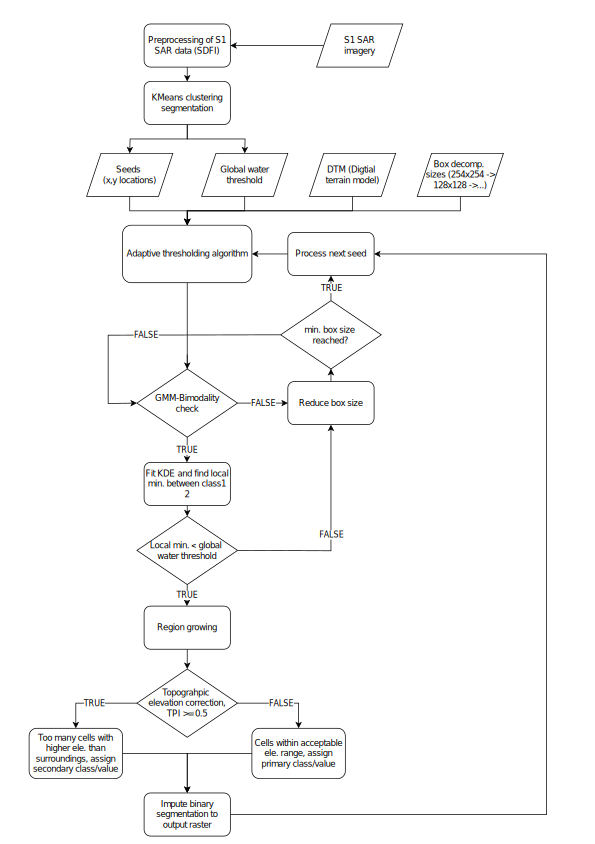
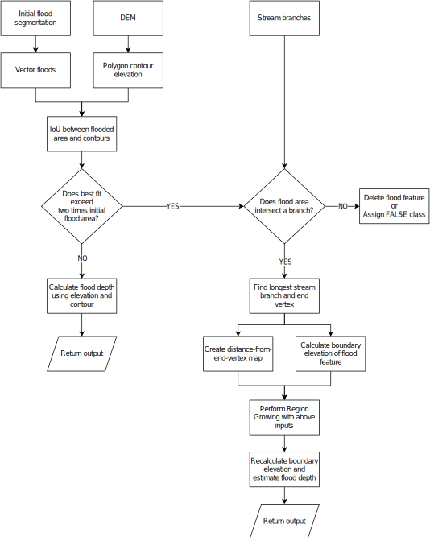

<!--
-->

<!-- PROJECT SHIELDS -->
<!--
*** I'm using markdown "reference style" links for readability.
*** Reference links are enclosed in brackets [ ] instead of parentheses ( ).
*** See the bottom of this document for the declaration of the reference variables
*** for contributors-url, forks-url, etc. This is an optional, concise syntax you may use.
*** https://www.markdownguide.org/basic-syntax/#reference-style-links
-->
<!-- [![Contributors][contributors-shield]][contributors-url]
***[![Forks][forks-shield]][forks-url]
***[![Stargazers][stars-shield]][stars-url]
***[![Issues][issues-shield]][issues-url]
***[![MIT License][license-shield]][license-url]
***[![LinkedIn][linkedin-shield]][linkedin-url]
<!--

<!-- PROJECT LOGO -->
 

  

  <h3 align="center">FloodMapping</h3>

  

    A collection of scripts for mapping flooding on terrain using SAR imagery.
     
    <a href="https://github.com/mtoernerh"><strong>Explore the contents »</strong></a>
     
     
    <a href="https://github.com/mtoernerh/FloodMapping/example">View Examples</a>
    ·
    <a href="https://github.com/mtoernerh/FloodMapping/issues">Report Bug</a>
    ·
    <a href="https://github.com/mtoernerh/FloodMapping/issues">Request Feature</a>
  

<!-- TABLE OF CONTENTS -->

  
Table of Contents

  <ol>
    <li>
      <a href="#introduction">Introduction</a>
      <ul>
        <li><a href="#requirements">Requirements</a></li>
      </ul>
    </li>
    <li>
      <a href="#Algorithms">Algorithms</a>
      <ul>
        <li><a href="#adaptive-thresholding">Adaptive Thresholding</a></li>
        <li><a href="#topographic-correction">Topographic Correction</a></li>
      </ul>
    </li>
    <li><a href="#usage">Usage</a></li>
    <li><a href="#roadmap">Roadmap</a></li>
    <li><a href="#citing">Citing</a></li>
    <li><a href="#license">License</a></li>
    <li><a href="#contact">Contact</a></li>
    <li><a href="#acknowledgments">Acknowledgments</a></li>
  </ol>

<!-- Introduction -->
## Introduction

FloodMapping is a project for mapping flooding with various algorithms using Sentinel-1 SAR and digital elevation data. The code is developed with the specific purpose of creating a reference flood dataset for fluvial, pluvial and groundwater flooding in Denmark. The project includes various utility functions to assist the mapping process, but the main algorithms includes (1) a KMeans estimate of a global threshold between water- and background class, (2) bimodality test using Gaussian Mixture Model (GMM) and Between-Class-Variance (BCV), (2) local minimum estimate  between water- and background class using KDE smoothening, (3) quadtree- and box decomposition for image tiling, (4) region growing for segmentation of water- and background class and (5) a function for correcting the segmented flooding features using digital elevation.

(<a href="#readme-top">back to top</a>)

### Requirements

 
 

(<a href="#readme-top">back to top</a>)

<!-- GETTING STARTED -->

## Algorithms

The workflow for the QuadTree- and Box decomposition approach is presented below.

### Adaptive Thresholding

Box             |  QuadTree
:-------------------------:|:-------------------------:
 |  

Box             |  QuadTree
:-------------------------:|:-------------------------:
 |  

### Topographic Correction

(<a href="#readme-top">back to top</a>)

<!-- USAGE EXAMPLES -->
## Usage

The code is developed specifically for a flood warning project where flood extent reference data for machine learning and hydrological modelling purposes were required, and not initially intended for public usage. Therefor, the code is not exactly plug-and-play and users will probably need to alter the code to their own specific needs. Jupyter notebook examples using sample data are available, which showcases how the different functions are utilized. There are in total three examples, where the first example (1) showcases segmentation of water and background using KMeans clustering, example (2) showcases the use of quadtree- and box decomposition for image tiling and region growing for segmentation and the last example (3) showcases a novel topographic correction approach where a digital elevation model is leveraged to better delineate water and background.

_For more examples, please refer to the [Documentation](https://github.com/mtoernerh/FloodMapping/example)_

### Data
The following data is included for testing and running examples.
* S1 SAR imagery (10 x 10 m)
* Digital Elevation Model (10 x 10 m)
* Ocean-land mask (10 x 10 m)
* Streams (shapefile)
### Example
To-be-added

(<a href="#readme-top">back to top</a>)

<!-- ROADMAP -->
## Roadmap

- [x] Raw code uploaded
- [x] Example data
- [ ] Jupyter examples
- [ ] Link to scientific article
- [ ] Code clean-up

See the [open issues](https://github.com/mtoernerh/FloodMapping/issues) for a full list of proposed features (and known issues).

(<a href="#readme-top">back to top</a>)

<!-- CONTRIBUTING -->
## Citing

To-be-added...

(<a href="#readme-top">back to top</a>)

<!-- LICENSE -->
## License

Distributed under the MIT License. See `LICENSE.txt` for more information.

(<a href="#readme-top">back to top</a>)

<!-- CONTACT -->
## Contact

Mark Frenstrup Tørner Hansen - m.toernerhansen@proton.me

Project Link: [https://github.com/mtoernerh/FloodMapping/](https://github.com/mtoernerh/FloodMapping/)

(<a href="#readme-top">back to top</a>)

<!-- ACKNOWLEDGMENTS -->
## Acknowledgments

* [Geological Survey of Denmark and Greenland](https://eng.geus.dk/)
* [Agency for Data Supply and Infrastructure](https://eng.sdfi.dk/)
* [Best-README-Template](https://github.com/othneildrew/Best-README-Template)

(<a href="#readme-top">back to top</a>)

<!-- MARKDOWN LINKS & IMAGES -->
<!-- https://www.markdownguide.org/basic-syntax/#reference-style-links -->
[contributors-shield]: https://img.shields.io/github/contributors/othneildrew/Best-README-Template.svg?style=for-the-badge
[contributors-url]: https://github.com/mtoernerh/FloodMapping/graphs/contributors
[forks-shield]: https://img.shields.io/github/forks/othneildrew/Best-README-Template.svg?style=for-the-badge
[forks-url]: https://github.com/mtoernerh/FloodMapping/network/members
[stars-shield]: https://img.shields.io/github/stars/othneildrew/Best-README-Template.svg?style=for-the-badge
[stars-url]: https://github.com/mtoernerh/FloodMapping/
[issues-shield]: https://img.shields.io/github/issues/othneildrew/Best-README-Template.svg?style=for-the-badge
[issues-url]: https://github.com/mtoernerh/FloodMapping/issues
[license-shield]: https://img.shields.io/github/license/othneildrew/Best-README-Template.svg?style=for-the-badge
[license-url]: https://github.com/othneildrew/Best-README-Template/blob/master/LICENSE.txt
[linkedin-shield]: https://img.shields.io/badge/-LinkedIn-black.svg?style=for-the-badge&logo=linkedin&colorB=555
[linkedin-url]: https://linkedin.com/in/mark-hansen-b0267312b
[product-screenshot]: images/screenshot.png
[Next.js]: https://img.shields.io/badge/next.js-000000?style=for-the-badge&logo=nextdotjs&logoColor=white
[Next-url]: https://nextjs.org/
[React.js]: https://img.shields.io/badge/React-20232A?style=for-the-badge&logo=react&logoColor=61DAFB
[React-url]: https://reactjs.org/
[Vue.js]: https://img.shields.io/badge/Vue.js-35495E?style=for-the-badge&logo=vuedotjs&logoColor=4FC08D
[Vue-url]: https://vuejs.org/
[Angular.io]: https://img.shields.io/badge/Angular-DD0031?style=for-the-badge&logo=angular&logoColor=white
[Angular-url]: https://angular.io/
[Svelte.dev]: https://img.shields.io/badge/Svelte-4A4A55?style=for-the-badge&logo=svelte&logoColor=FF3E00
[Svelte-url]: https://svelte.dev/
[Laravel.com]: https://img.shields.io/badge/Laravel-FF2D20?style=for-the-badge&logo=laravel&logoColor=white
[Laravel-url]: https://laravel.com
[Bootstrap.com]: https://img.shields.io/badge/Bootstrap-563D7C?style=for-the-badge&logo=bootstrap&logoColor=white
[Bootstrap-url]: https://getbootstrap.com
[JQuery.com]: https://img.shields.io/badge/jQuery-0769AD?style=for-the-badge&logo=jquery&logoColor=white
[JQuery-url]: https://jquery.com 
[box]: https://github.com/mtoernerh/FloodMapping/images/box.svg
[quadtree]: https://github.com/mtoernerh/FloodMapping/images/quadtree.svg
[box_illustration]: https://github.com/mtoernerh/FloodMapping/images/box__illustration.svg
[quadtree_illustration]: https://github.com/mtoernerh/FloodMapping/images/quadtree__illustration.svg
[Ribe_GIF]: https://github.com/mtoernerh/FloodMapping/images/ribe_flooding.gif
