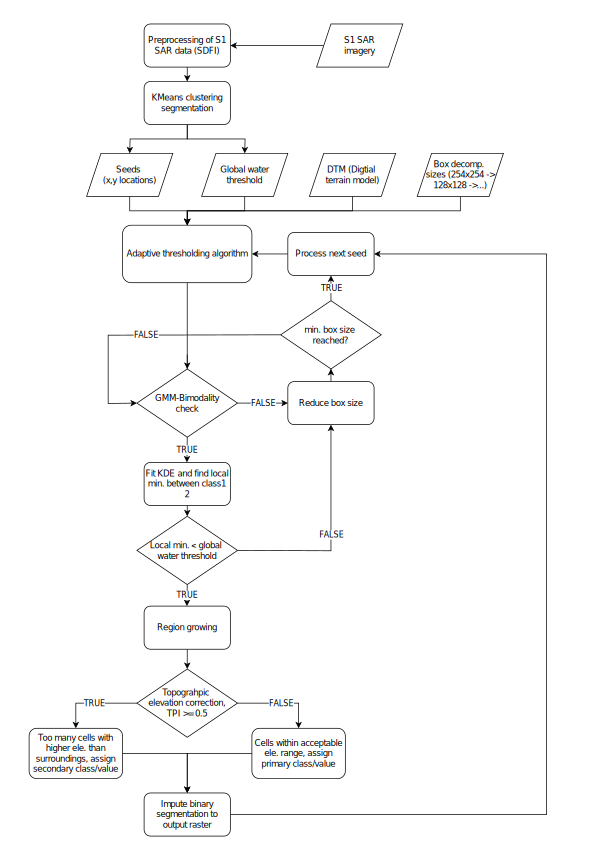
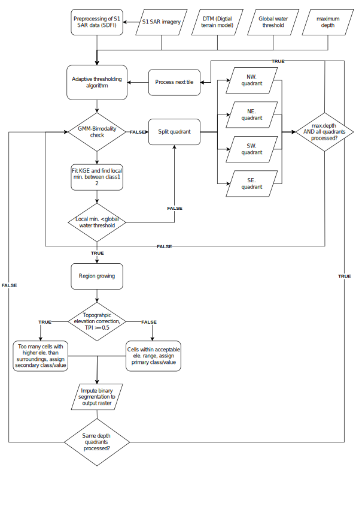
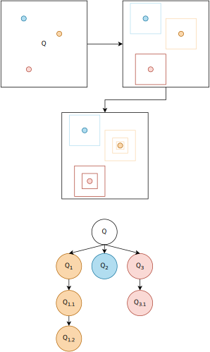
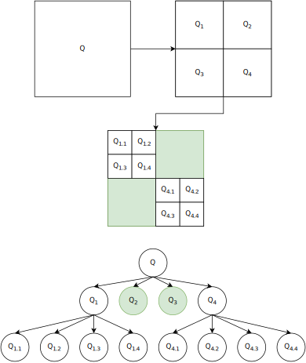
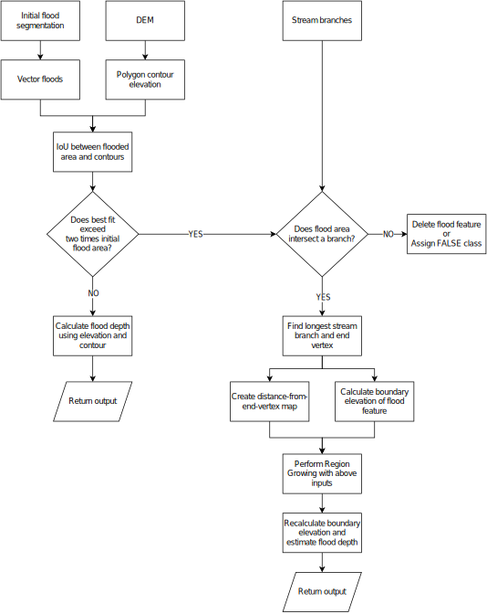

<!-- Improved compatibility of back to top link: See: https://github.com/othneildrew/Best-README-Template/pull/73 -->

<!--
-->

<!-- PROJECT SHIELDS -->
<!--
*** I'm using markdown "reference style" links for readability.
*** Reference links are enclosed in brackets [ ] instead of parentheses ( ).
*** See the bottom of this document for the declaration of the reference variables
*** for contributors-url, forks-url, etc. This is an optional, concise syntax you may use.
*** https://www.markdownguide.org/basic-syntax/#reference-style-links
-->
[![Contributors][contributors-shield]][contributors-url]
[![Forks][forks-shield]][forks-url]
[![Stargazers][stars-shield]][stars-url]
[![Issues][issues-shield]][issues-url]
[![MIT License][license-shield]][license-url]
[![LinkedIn][linkedin-shield]][linkedin-url]

<!-- PROJECT LOGO -->
 

  

  <h3 align="center">FloodMapping</h3>

  

    A collection of scripts for mapping flooding on terrain using SAR imagery.
     
    <a href="https://github.com/othneildrew/Best-README-Template"><strong>Explore the docs »</strong></a>
     
     
    <a href="https://github.com/othneildrew/Best-README-Template">View Demo</a>
    ·
    <a href="https://github.com/othneildrew/Best-README-Template/issues">Report Bug</a>
    ·
    <a href="https://github.com/othneildrew/Best-README-Template/issues">Request Feature</a>
  

<!-- TABLE OF CONTENTS -->

  
Table of Contents

  <ol>
    <li>
      <a href="#introduction">Introduction</a>
      <ul>
        <li><a href="#requirements">Requirements</a></li>
      </ul>
    </li>
    <li>
      <a href="#Algorithms">Algorithms</a>
      <ul>
        <li><a href="#adaptive-thresholding">Adaptive Thresholding</a></li>
        <li><a href="#topographic-correction">Topographic Correction</a></li>
      </ul>
    </li>
    <li><a href="#usage">Usage</a></li>
    <li><a href="#roadmap">Roadmap</a></li>
    <li><a href="#contributing">Contributing</a></li>
    <li><a href="#license">License</a></li>
    <li><a href="#contact">Contact</a></li>
    <li><a href="#acknowledgments">Acknowledgments</a></li>
  </ol>

<!-- Introduction -->
## Introduction

FloodMapping is a project for mapping flooding with various algorithms using Sentinel-1 SAR- and digital elevation data. The code is developed with the specific purpose creating a reference flood dataset for fluvial, pluvial and groundwater flooding in Denmark. The project includes various utility functions to assist the mapping process, but the main algorithms includes (1) a KMeans estimate of a global threshold between water- and background class, (2) bimodality test using gaussian mixture modelling and between-class-variance, (2) local minimum estimate  between water- and background class using KDE smoothening, (3) quadtree- and box decomposition for image tiling, (4) region growing for segmentation of water- and background class and (5) a function for correcting the segmented flooding features using digital elevation.

(<a href="#readme-top">back to top</a>)

### Requirements

 
 

(<a href="#readme-top">back to top</a>)

<!-- GETTING STARTED -->

## Algorithms

This is an example of how you may give instructions on setting up your project locally.
To get a local copy up and running follow these simple example steps.

### Adaptive Thresholding

Box             |  QuadTree
:-------------------------:|:-------------------------:
 |  

Box             |  QuadTree
:-------------------------:|:-------------------------:
 |  

### Topographic Correction

(<a href="#readme-top">back to top</a>)

<!-- USAGE EXAMPLES -->
## Usage

The code is developed specifically for this project, and not initially intended for public usage

_For more examples, please refer to the [Documentation](https://github.com/mtoernerh/FloodMapping/examples)_

### Data
* S1 SAR imagery (10 x 10 m)
* Digital Elevation Model (10 x 10 m)
* Ocean-land mask (10 x 10 m)
* Streams (shapefile)
### Example
To-be-added

(<a href="#readme-top">back to top</a>)

<!-- ROADMAP -->
## Roadmap

- [x] Add Changelog
- [x] Add back to top links
- [ ] Add Additional Templates w/ Examples
- [ ] Add "components" document to easily copy & paste sections of the readme
- [ ] Multi-language Support
    - [ ] Chinese
    - [ ] Spanish

See the [open issues](https://github.com/othneildrew/Best-README-Template/issues) for a full list of proposed features (and known issues).

(<a href="#readme-top">back to top</a>)

<!-- CONTRIBUTING -->
## Contributing

Contributions are what make the open source community such an amazing place to learn, inspire, and create. Any contributions you make are **greatly appreciated**.

If you have a suggestion that would make this better, please fork the repo and create a pull request. You can also simply open an issue with the tag "enhancement".
Don't forget to give the project a star! Thanks again!

1. Fork the Project
2. Create your Feature Branch (`git checkout -b feature/AmazingFeature`)
3. Commit your Changes (`git commit -m 'Add some AmazingFeature'`)
4. Push to the Branch (`git push origin feature/AmazingFeature`)
5. Open a Pull Request

(<a href="#readme-top">back to top</a>)

<!-- LICENSE -->
## License

Distributed under the MIT License. See `LICENSE.txt` for more information.

(<a href="#readme-top">back to top</a>)

<!-- CONTACT -->
## Contact

Mark Frenstrup Tørner Hansen - [@your_twitter](https://twitter.com/your_username) - m.toernerhansen@proton.me

Project Link: [https://github.com/mtoernerh/FloodMapping/](https://github.com/mtoernerh/FloodMapping/)

(<a href="#readme-top">back to top</a>)

<!-- ACKNOWLEDGMENTS -->
## Acknowledgments

Use this space to list resources you find helpful and would like to give credit to. I've included a few of my favorites to kick things off!

* [Geological Survey of Denmark and Greenland](https://eng.geus.dk/)
* [Agency for Data Supply and Infrastructure](https://eng.sdfi.dk/)
* 

(<a href="#readme-top">back to top</a>)

<!-- MARKDOWN LINKS & IMAGES -->
<!-- https://www.markdownguide.org/basic-syntax/#reference-style-links -->
[contributors-shield]: https://img.shields.io/github/contributors/othneildrew/Best-README-Template.svg?style=for-the-badge
[contributors-url]: https://github.com/othneildrew/Best-README-Template/graphs/contributors
[forks-shield]: https://img.shields.io/github/forks/othneildrew/Best-README-Template.svg?style=for-the-badge
[forks-url]: https://github.com/othneildrew/Best-README-Template/network/members
[stars-shield]: https://img.shields.io/github/stars/othneildrew/Best-README-Template.svg?style=for-the-badge
[stars-url]: https://github.com/othneildrew/Best-README-Template/stargazers
[issues-shield]: https://img.shields.io/github/issues/othneildrew/Best-README-Template.svg?style=for-the-badge
[issues-url]: https://github.com/othneildrew/Best-README-Template/issues
[license-shield]: https://img.shields.io/github/license/othneildrew/Best-README-Template.svg?style=for-the-badge
[license-url]: https://github.com/othneildrew/Best-README-Template/blob/master/LICENSE.txt
[linkedin-shield]: https://img.shields.io/badge/-LinkedIn-black.svg?style=for-the-badge&logo=linkedin&colorB=555
[linkedin-url]: https://linkedin.com/in/mark-hansen-b0267312b
[product-screenshot]: images/screenshot.png
[Next.js]: https://img.shields.io/badge/next.js-000000?style=for-the-badge&logo=nextdotjs&logoColor=white
[Next-url]: https://nextjs.org/
[React.js]: https://img.shields.io/badge/React-20232A?style=for-the-badge&logo=react&logoColor=61DAFB
[React-url]: https://reactjs.org/
[Vue.js]: https://img.shields.io/badge/Vue.js-35495E?style=for-the-badge&logo=vuedotjs&logoColor=4FC08D
[Vue-url]: https://vuejs.org/
[Angular.io]: https://img.shields.io/badge/Angular-DD0031?style=for-the-badge&logo=angular&logoColor=white
[Angular-url]: https://angular.io/
[Svelte.dev]: https://img.shields.io/badge/Svelte-4A4A55?style=for-the-badge&logo=svelte&logoColor=FF3E00
[Svelte-url]: https://svelte.dev/
[Laravel.com]: https://img.shields.io/badge/Laravel-FF2D20?style=for-the-badge&logo=laravel&logoColor=white
[Laravel-url]: https://laravel.com
[Bootstrap.com]: https://img.shields.io/badge/Bootstrap-563D7C?style=for-the-badge&logo=bootstrap&logoColor=white
[Bootstrap-url]: https://getbootstrap.com
[JQuery.com]: https://img.shields.io/badge/jQuery-0769AD?style=for-the-badge&logo=jquery&logoColor=white
[JQuery-url]: https://jquery.com 
[box]: https://github.com/mtoernerh/FloodMapping/images/box.svg
[quadtree]: https://github.com/mtoernerh/FloodMapping/images/quadtree.svg
[box_illustration]: https://github.com/mtoernerh/FloodMapping/images/box__illustration.svg
[quadtree_illustration]: https://github.com/mtoernerh/FloodMapping/images/quadtree__illustration.svg
